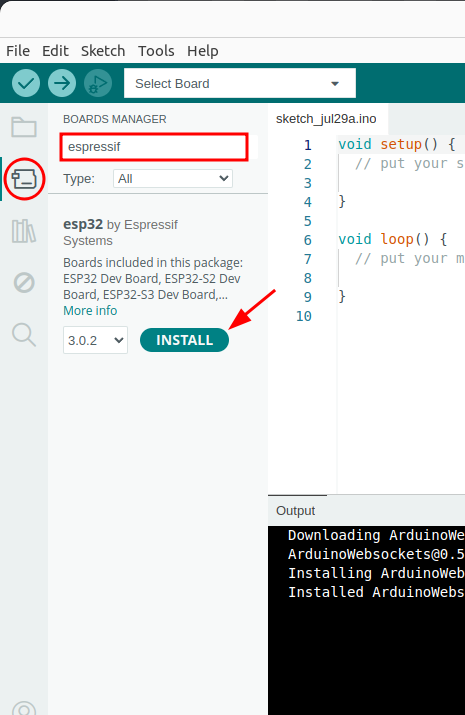
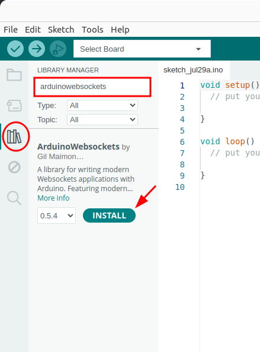

# Sensing Network ROS2 interface

This is a interface inbetween the sensing networks made by [Bae, et al.](https://sandrabae.github.io/sensing-network/index.html).
It is made to run on the [ESP32-C6 Pocket board by Sparkfun Electronics](https://www.sparkfun.com/products/22925)
and interface over websockets to a python webserver which publishes the updated touch values from various sensors at a consistent rate to a ROS node.

## Getting started

To get started first clone this repository into your ROS2 workspace

```bash
cd ros2_ws/src
git clone https://github.com/alexDickhans/sensing_network_ros
```

### Setting up the Arduino IDE

Download the Arduino IDE from [here](https://www.arduino.cc/en/software) and install. After installation press on board manager(left menu):



Then install the Arduino Websockets package by [Gil Maimon](https://github.com/gilmaimon):



#### Using the calibration script

Open the "calibration" folder in this repository and run the script. Open the serial monitor in Arduino and follow the on-screen directions to complete the calibration procedure.
Make sure that all commented areas at the beginning of the program are changed to their appropriate values.
Use the index values generated by the skin simulation program to set the correct indecies for the skin units in each joint.
At the end of this process, it will output the struct that is needed in the "arduino" file to have the calibration match to the robot.

#### Uploading final code

Copy and paste the struct from the calibration script and put it in the specified location in the "arduino/arduino.ino" file. This will make the real sensor reflect your calibration.
Open the "arduino" project in this repository, and change the SSID and password to reflect your wifi network,
and the IP address to reflect the local address of the websocket server computer. Additionally you can change the port as required.

### Setting up ROS

The python package depends on the python websockets API, which you have to install with pip:

```bash
pip3 install websockets
```

Build your ROS workspace:

```bash
cd ros2_ws
colcon build
```

Source the installation file:

```bash
source install/setup.bash
```

Run the python script:

```bash
ros2 run sensing_network_ros sensing_network
```

## Citations

S. Sandra Bae, Takanori Fujiwara, Anders Ynnerman, Ellen Yi-Luen Do, Michael L. Rivera, and Danielle Albers Szafir. 2023. "A Computational Design Process to Fabricate Sensing Network Physicalizations". In: IEEE Transactions on Visualization & Computer Graphics (VIS '23) (Melbourne, Australia, October 22—27, 2023).
